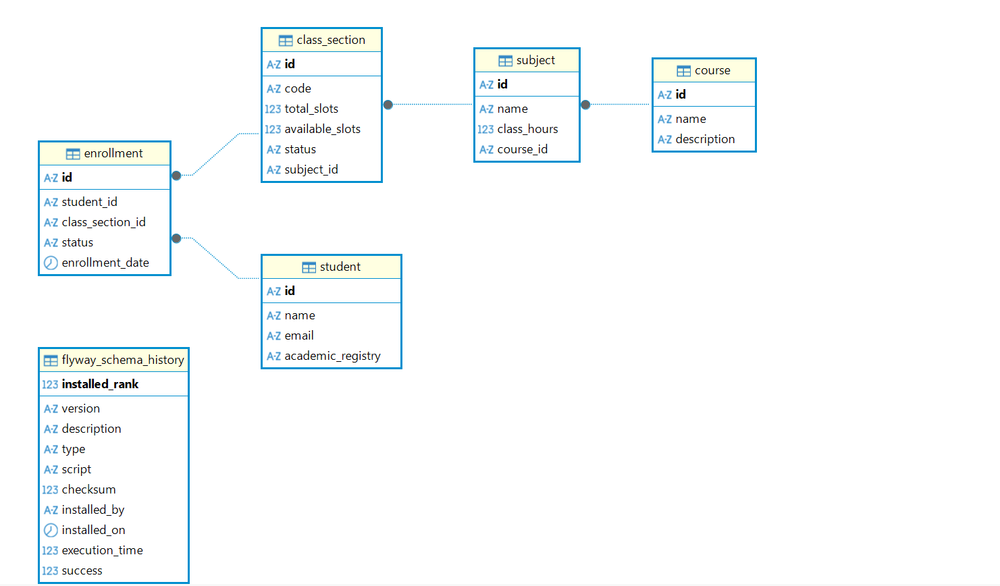

# Sistema Acadêmico de Matrículas

Este projeto é uma API REST para um sistema de matrículas acadêmicas, desenvolvido como parte de um desafio técnico. A API permite gerenciar alunos, cursos, disciplinas, turmas e o processo de matrícula, com foco em código limpo, boas práticas de desenvolvimento e uma arquitetura de serviços bem definida.

---

## ✨ Features

*   Gerenciamento completo de Alunos, Cursos, Disciplinas e Turmas (CRUD).
*   Processo de Matrícula com status (Solicitada, Confirmada, Cancelada).
*   Validação de regras de negócio, como limite de vagas e duplicidade de matrícula.
*   API RESTful com endpoints semânticos e documentação Swagger.
*   Frontend reativo em Angular para interação com a API.

---

## 🛠️ Tecnologias Utilizadas

*   **Backend:**
    *   Java 17
    *   Spring Boot 3 (Web, Data JPA)
    *   Hibernate
*   **Frontend:**
    *   Angular 18
    *   TypeScript
    *   Angular Material & SCSS
*   **Banco de Dados e Ferramentas:**
    *   MySQL 8.0
    *   Flyway (Migrações de Banco de Dados)
    *   Docker e Docker Compose
    *   Maven
    *   Lombok
    *   Swagger (Documentação e Teste de API)
    *   DBeaver (Modelagem de Dados)
*   **Assistência de IA:**
    *   Google Gemini (Backend e Frontend)

---

## 🏗️ Arquitetura e Decisões de Design

*   **Arquitetura Monolítica:** A lógica reside em uma única aplicação Spring Boot para simplicidade.
*   **Padrão de Camadas (`Controller` -> `Service` -> `Repository`):** Separação clara de responsabilidades, com a lógica de negócio concentrada na camada de serviço.
*   **Programação para Interfaces:** Os controllers dependem de abstrações (`CourseService`) em vez de implementações concretas, facilitando testes e manutenibilidade.
*   **Injeção de Dependência por Construtor:** Utilizada em todas as classes para garantir imutabilidade e clareza.
*   **Tratamento de Erros Semântico:** Exceções customizadas (`ResourceNotFoundException`, `ValidationException`) para retornar respostas HTTP claras.
*   **Componentização no Frontend:** A UI é construída com componentes Angular focados e reutilizáveis, com chamadas HTTP centralizadas em serviços.

---

## 🚀 Como Rodar o Projeto Localmente

### 1. Pré-requisitos

*   **Java (JDK):** Versão 17 ou superior.
*   **Maven:** Versão 3.8 ou superior.
*   **Node.js:** Versão 18 ou superior.
*   **Angular CLI:** Versão 18 ou superior.
*   **Docker e Docker Compose:** Instalados e em execução.

### 2. Backend (API)

1.  **Clone o Repositório:**
    ```bash
    git clone https://github.com/Chrystian-Miguel/SistemaDeMatriculas.git
    cd SistemaDeMatriculas
    ```
2.  **Inicie o Banco de Dados com Docker:**
    ```bash
    docker-compose up -d
    ```
    O banco de dados MySQL estará acessível na porta `3306`.
3.  **Execute a Aplicação Spring Boot:**
    ```bash
    mvn spring-boot:run ou .\mvnw spring-boot:run
    ```
    A API estará disponível em `http://localhost:8080`.

### 3. Frontend (Angular UI)

1.  **Navegue até a Pasta do Frontend:**
    ```bash
    cd academic-system-frontend
    ```
2.  **Instale as Dependências:**
    ```bash
    npm install
    ```
3.  **Execute a Aplicação Angular:**
    ```bash
    ng serve
    ```
    Acesse a aplicação no seu navegador em `http://localhost:4200/`.

---

## Endpoints Principais da API

A API está organizada em torno dos seguintes recursos:

*   `GET, POST, PUT, DELETE /api/students`: Gerenciamento de Alunos.
*   `GET, POST, PUT, DELETE /api/courses`: Gerenciamento de Cursos.
*   `GET, POST, PUT, DELETE /api/subjects`: Gerenciamento de Disciplinas.
*   `GET, POST, PUT, DELETE /api/class-sections`: Gerenciamento de Turmas.
*   `GET, POST, PUT, DELETE /api/enrollments`: Gerenciamento de Matrículas.

A documentação completa e interativa está disponível via Swagger em:
**`http://localhost:8080/swagger-ui/index.html`**

---

## 🧪 Testes Manuais e Validação de Regras

### Fluxo de Matrícula

Para testar o fluxo completo, siga estes passos no frontend ou via Swagger:

1.  **Crie os Dados Básicos:**
    *   Crie um **Curso**.
    *   Crie uma **Disciplina** (associada ao curso).
    *   Crie um **Aluno**.
    *   Crie uma **Turma** (para a disciplina, definindo um número de vagas).
2.  **Solicite a Matrícula:**
    *   Crie uma nova matrícula associando o aluno à turma. O status inicial será `PENDING`.
3.  **Confirme a Matrícula:**
    *   Altere o status da matrícula para `CONFIRMED`. A vaga na turma será decrementada.

### Validação de Limite de Vagas

1.  Crie uma turma com **1 vaga**.
2.  Matricule e **confirme** a matrícula de um aluno.
3.  Verifique se o número de vagas disponíveis na turma é **0**.
4.  Tente solicitar uma nova matrícula para a mesma turma com um segundo aluno.
5.  **Resultado Esperado:** A API deve retornar um erro **`400 Bad Request`** com a mensagem: `{"error": "Cannot request enrollment: no available slots left."}`, e o frontend deve exibir uma notificação de erro.

---

## 📝 Limitações Conhecidas

*   **Exclusão Física (Hard Delete):** A aplicação utiliza exclusão física. A remoção de entidades "pai" (como um Curso) falhará se houver entidades "filhas" (Disciplinas) associadas, resultando em um erro `500 Internal Server Error`. Uma abordagem de "soft delete" não foi implementada.
*   **Ausência de Paginação:** Os endpoints de listagem retornam todos os registros de uma vez, o que pode impactar a performance com grandes volumes de dados.
*   **Filtros Client-Side:** A filtragem de dados nas tabelas do frontend é feita no lado do cliente, sendo ideal apenas para volumes de dados menores.

---

## 🤖 Uso de Ferramentas de IA

Este projeto foi desenvolvido com o auxílio de uma ferramenta de IA (assistente de desenvolvimento em IDE). A colaboração ocorreu nas seguintes áreas:

*   **Geração de Código Boilerplate**
*   **Refatoração:** Aplicação de anotações Lombok, extração de lógica para métodos auxiliares.
*   **Explicação de Conceitos**
*   **Sugestão de abordagens**
*   **Análise de erros**
*   **Auxílio na estilização dos componentes visuais**


**Revisão Manual:** Todo o código e as sugestões geradas pela IA foram revisados e aprovados pelo desenvolvedor responsável, que reteve o controle total sobre as decisões de arquitetura e a qualidade final do código.

---

## 📊 Esquema do Banco de Dados




## Referencias 
https://medium.com/@jeffersonfabriciodev/o-uso-do-autowired-no-spring-%C3%A9-uma-m%C3%A1-pratica-a23378be3c27

https://medium.com/@AlexanderObregon/enhancing-logging-with-log-and-slf4j-in-spring-boot-applications-f7e70c6e4cc7

https://vladmihalcea.com/the-best-way-to-map-a-onetomany-association-with-jpa-and-hibernate/

https://refactoring.guru/pt-br/design-patterns/facade


